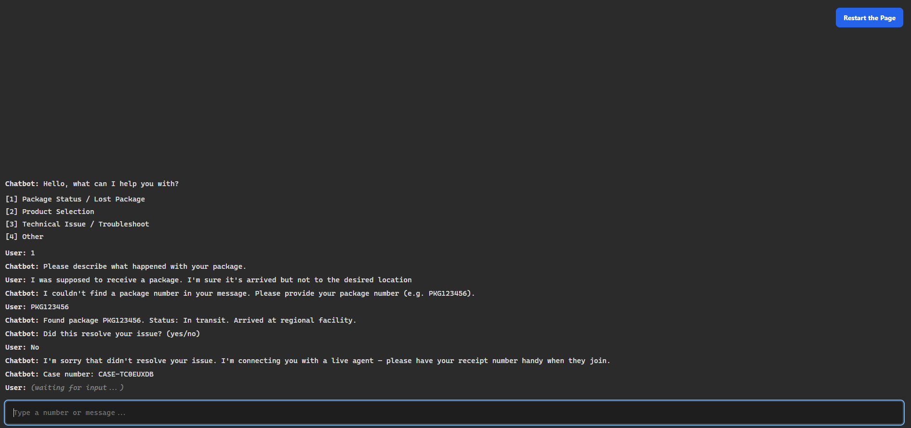
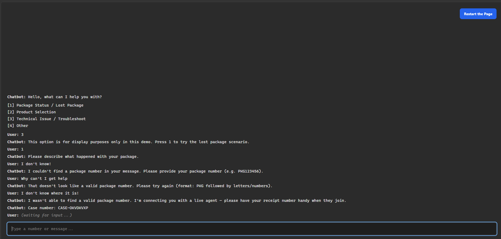
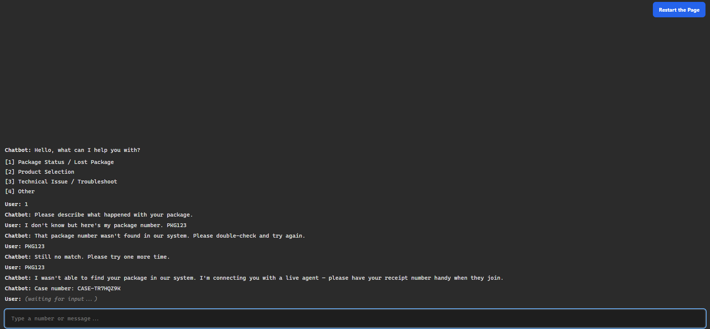

# chatbot-eGain
Lost Package Support Bot

A scripted decision-tree chatbot that triages lost-package complaints. It resolves simple tracking lookups directly and escalates everything else to a live agent with the collected info and a case number — so the customer never repeats themselves and never hits a dead end.

Built as a take-home for the Analyst / Solution Success role at eGain.

## Setup
No installation or dependencies required — runs in any browser.
1. Click the green **Code** button and select **Download ZIP**
2. Extract the ZIP file
3. Open `index.html` in your browser


Or via command line:
```bash
git clone <your-repo-url>
cd <repo-folder>
open index.html
```

## Test Data 

The bot looks up tracking numbers against a demo database. Use any of these valid numbers to test the happy path:
| Tracking number | Status      | Last update                    |
|-----------------|-------------|--------------------------------|
| `PKG123456`     | In transit  | Arrived at regional facility   |
| `PKG789012`     | Delivered   | Left at front door             |
| `PKG000001`     | Lost        | No scan in 7 days              |

Any other valid `PKG...` format tests the not-found → retry → escalation path.

## Conversation Flow


# Approach

This bot takes a CLI-stylistic approach and has a determinsitic state logic. Each state has a prompt , an input validator , and transitions into the next state. There is no fuzzy logic anywhere so every path is testable and predictable.

Here are the decisions I made on the design:

1. Free-Text intake first - Customers may vent out their frustration and/or may give us information that they may know we are looking for already. In this case the bot scans for a package number within that text and sees if we can extract it without needing to prompt for it directly

2. Retry caps on every prompt. Each input gets a maximum of 2 retries. After that, the both stops asking and escalates. The user is never trapped in a validation loop

3.Every path terminates. Each conversation ends in exactly one of two states: Either it is resolved by the bot or handed off to a live agen with all collected info and a case number attatched. The agent never starts from zero, and the customer leaves with a reference number. 

# Error Handling

1. Menu Input Validation - The menu accepted digits 1-4 only. Anything else triggers a reprompt.

2. Tracking number format validation - Tracking numbers must match the expected format. A malformed number triggers a reprompt with an example of the correct format. After 2 failed attempts the bot will escalate with the info it has to a live agent

# Screenshots

### Happy path — package found


### No package number in description


### Package not in database
