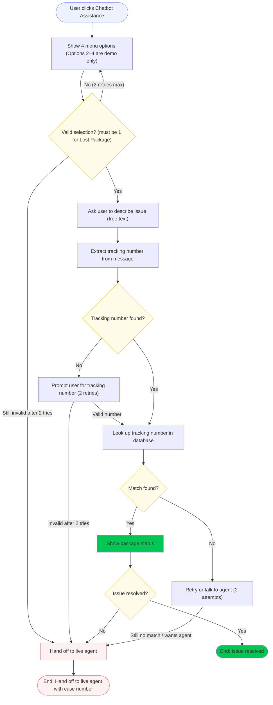

# chatbot-eGain
Chatbot Design Scenario based on a user having problems with a lost package

```mermaid
flowchart TB
    A(["User clicks Chatbot Assistance"]) --> B["Show 4 menu options (Options 2–4 are demo only)"]
    B --> C{"Valid selection? (must be 1 for Lost Package)"}
    C -- No (2 retries max) --> B
    C -- Still invalid after 2 tries --> Z["Hand off to live agent"]
    C -- Yes --> D["Ask user to describe issue (free text)"]
    D --> G["Extract tracking number from message"]
    G --> H{"Tracking number found?"}
    H -- No --> H1["Prompt user for tracking number (2 retries)"]
    H1 -- Valid number --> I
    H1 -- Invalid after 2 tries --> Z
    H -- Yes --> I["Look up tracking number in database"]
    I --> J{"Match found?"}
    J -- Yes --> K["Show package status"]
    K --> L{"Issue resolved?"}
    L -- Yes --> M(["End: Issue resolved"])
    L -- No --> Z
    J -- No --> J1["Retry or talk to agent (2 attempts)"]
    J1 -- Still no match / wants agent --> Z
    Z --> N(["End: Hand off to live agent with case number"])

     A:::user
     C:::decision
     Z:::agent
     H:::decision
     J:::decision
     L:::decision
     N:::agent
    classDef user fill:#eef2ff,stroke:#818cf8
    classDef decision fill:#fefce8,stroke:#facc15
    classDef agent fill:#fff1f2,stroke:#fb7185
    style K fill:#00C853
    style M fill:#00C853
```